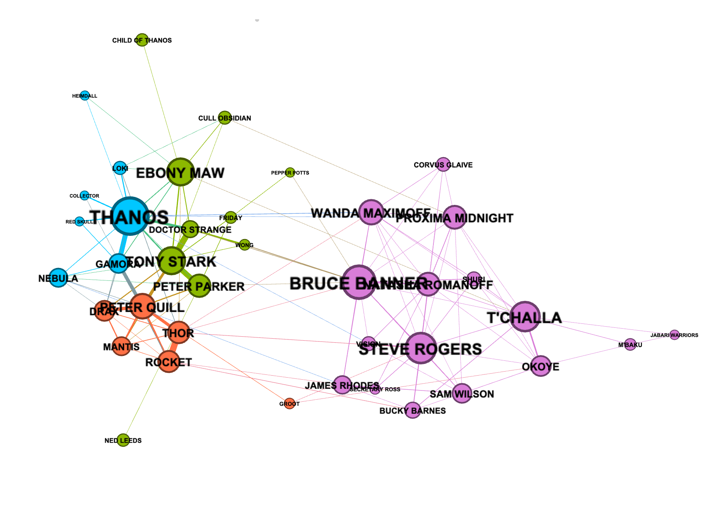
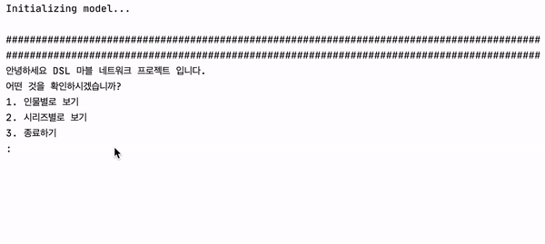

# 마블 어벤져스 네트워크 분석

By: 4기 김동욱, 4기 김새민, 5기 정승연, 5기 조신형, 5기 김보아

<DSL 21-1 모델링 프로젝트>

마블 세계관(Marvel Universe)에는 정말 다양한 캐릭터들이 존재합니다. 그 중에서도 어벤져스 시리즈는 세계관의 거의 모든 슈퍼히어로 및 빌런들이 등장하는 거대한 스케일의 작품이라고 할 수 있는데요, 해당 프로젝트에서는 여러 캐릭터들의 소셜 네트워크를 분석해보고자 합니다. 

---------------

## 데이터 수집 및 전처리

등장 인물들간의 상호작용을 고려하기 위해, 어벤져스의 각 시리즈 별 영화 스크립트에서 특정한 두 인물이 대화를 주고 받은 횟수를 상호작용의 지표로 가정하고 데이터를 수집했습니다. 좀 더 구체적으로, 동일한 씬(scene) 안에서 A라는 인물 다음에 B라는 인물의 대사가 있다면 이 두 인물 간 엣지 가중치를 하나 추가하는 방식으로 인접행렬 (adjacency matrix)을 정의했습니다. 이렇게 정의된 인접행렬을 바탕으로 각 시리즈 별로 등장인물이 노드(node)이며 등장인물간 대화 횟수가 엣지(edge)로 구성되는 네트워크를 생성했습니다. 영화 플롯의 특성을 고려할 때 네트워크 상에서 단순한 연결횟수를 넘어 인접 노드의 중요도까지 종합적으로 고려할 수 있는 centrality measure인 [pagerank centrality](https://ko.wikipedia.org/wiki/%ED%8E%98%EC%9D%B4%EC%A7%80%EB%9E%AD%ED%81%AC)를 분석에 사용했습니다. 

---------------

## 모델링

모델에 포함된 주요 내용은 다음과 같습니다.

< 캐릭터별>
- 캐릭터의 기본 정보(설명)
- 캐릭터와 관련된 핵심 키워드 (위키 문서에 TFIDF를 적용)
- 다른 캐릭터들과의 상호작용 강도
- 시리즈의 변화에 따른 캐릭터의 중요도 변화

<시리즈별>
- 핵심적인 인물 관계 
- 주요 등장인물
- 전체 네트워크 시각화 (Gephi 이용)
- 인물 간 관계 (우호/적대) 시각화 (Gephi 이용)

---------------

## 발전 방향 및 의의

- 영화 스크립트에서 각 인물이 서로 다른 호칭으로 명명되는 경우가 잦아 (ex. 캡틴아메리카, 캡틴, 스티브 ...) 이를 직접 정의함에 있어 어려움이 있었습니다.
- 또한 씬(scene)이 전환되는 부분에 대한 일정한 기준이 존재하지 않아 이 부분을 자동화할 수 있는 방법에 대한 논의가 필요합니다.
- 데이터만 유사한 형식으로 정의된다면 다른 영화 및 문학 작품 등으로도 확장되어 적용할 수 있을 것으로 생각됩니다. 즉, 특정한 문학 작품을 직접 읽지 않고도 등장 인물들의 관계를 대략적으로 파악할 수 있습니다.

---------------
#### <어벤져스: 인피니티 워 인물 관계도 예시>

---------------

#### 모델 실행 예시

